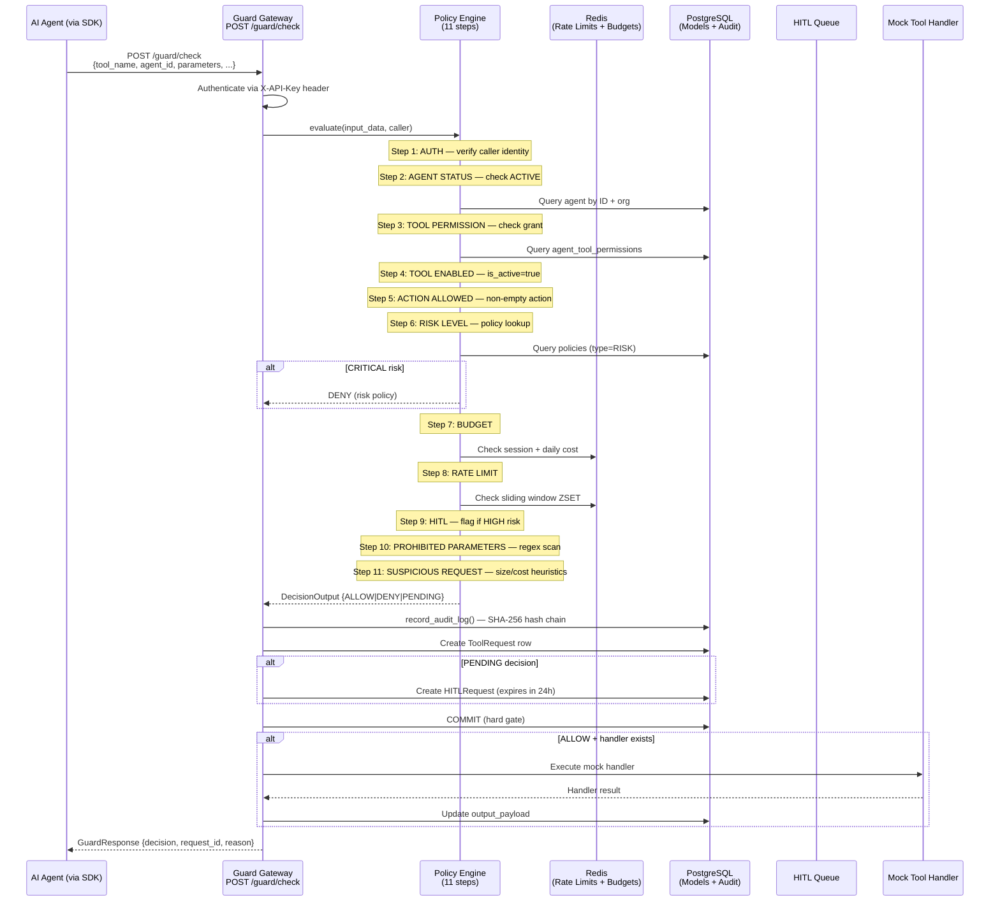
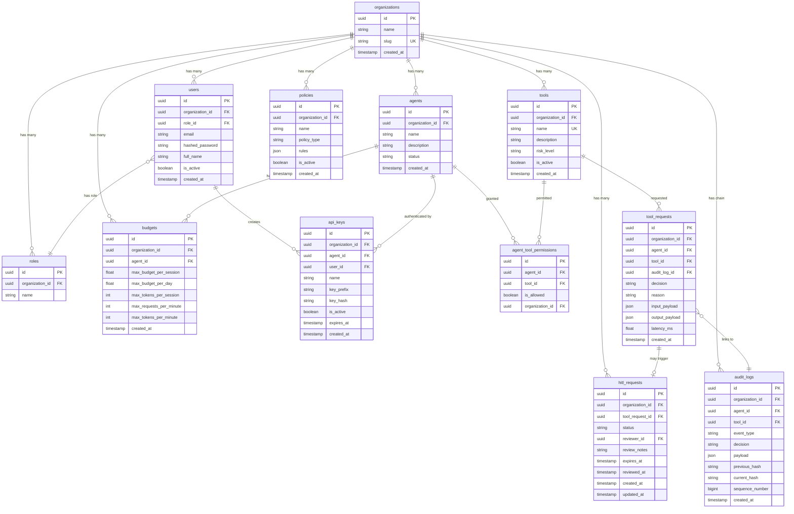

# Architecture

This document describes AgentGuard's system architecture as it is actually implemented in the codebase today.

---

## Three-Component Structure

AgentGuard is a hybrid B2B SaaS product made of three components:

```
┌─────────────────────────────────────────────────────────────────────┐
│                        Component C                                  │
│                   Control Plane (Dashboard)                         │
│            TanStack Start / React 19 / TypeScript                   │
│                                                                     │
│   Dashboard │ Agents │ Tools │ Policies │ Budgets │ Approvals       │
│   Audit Vault │ Settings                                            │
└───────────────────────────┬─────────────────────────────────────────┘
                            │ HTTP (JWT auth)
                            ▼
┌─────────────────────────────────────────────────────────────────────┐
│                        Component A                                  │
│                Core Engine (FastAPI Backend)                         │
│                                                                     │
│   ┌──────────────┐  ┌──────────────┐  ┌──────────────────────────┐ │
│   │ Auth / RBAC  │  │ Policy Engine│  │ Guard Gateway            │ │
│   │ JWT + API Key│  │ 11-step      │  │ POST /guard/check        │ │
│   └──────────────┘  │ pipeline     │  │ (the single chokepoint)  │ │
│                     └──────────────┘  └──────────────────────────┘ │
│   ┌──────────────┐  ┌──────────────┐  ┌──────────────────────────┐ │
│   │ Rate Limiter │  │ Budget Guard │  │ Audit Vault              │ │
│   │ Redis ZSET   │  │ Redis + PG   │  │ SHA-256 Hash Chain       │ │
│   └──────────────┘  └──────────────┘  └──────────────────────────┘ │
│   ┌──────────────┐  ┌──────────────┐                               │
│   │ HITL Engine  │  │ Mock Tools   │                               │
│   │ PENDING flow │  │ Safe handlers│                               │
│   └──────────────┘  └──────────────┘                               │
└───────────────────┬─────────────────────┬───────────────────────────┘
                    │                     │
                    ▼                     ▼
            ┌──────────────┐      ┌──────────────┐
            │ PostgreSQL   │      │ Redis 7      │
            │ 12 tables    │      │ Rate limits  │
            │ Audit chain  │      │ Budget totals│
            └──────────────┘      └──────────────┘

┌─────────────────────────────────────────────────────────────────────┐
│                        Component B                                  │
│                    Python SDK (agentguard-sdk)                       │
│                                                                     │
│   AgentGuard(api_key=...) → client.guard(tool=..., params=...)     │
│   → HTTP POST /guard/check → raises Denied/Pending or returns OK   │
│                                                                     │
│   Installed via: pip install -e ./sdk                               │
└─────────────────────────────────────────────────────────────────────┘
```

---

## Request Flow: End-to-End Decision Pipeline

When an agent proposes a tool call, this is the exact sequence:



### Key Invariants

1. **Commit-before-execute:** The audit log and decision are committed to PostgreSQL *before* any mock tool handler runs. If the commit fails, the handler never executes.
2. **Server-generated request_id:** The gateway generates a UUID for each request. Client-supplied IDs are never trusted.
3. **Handler errors don't hide ALLOW:** If a mock handler throws, the ALLOW decision still stands — the error is recorded in `output_payload`.
4. **DENY > PENDING > ALLOW:** Even if HITL flags PENDING at step 9, steps 10–11 can still escalate to DENY.

---

## Data Model

The database has 12 tables. Here is their structure and relationships:



### Table Roles

| Table | Purpose |
|-------|---------|
| `organizations` | Multi-tenant isolation boundary. Every other table references this. |
| `roles` | Per-org role definitions: ADMIN, SECURITY, AUDITOR, MANAGER, DEVELOPER |
| `users` | Human users of the Control Plane. Authenticated via JWT. |
| `agents` | Registered AI agents. Authenticated via API keys. |
| `tools` | Registered tools with risk levels (LOW, MEDIUM, HIGH, CRITICAL). |
| `agent_tool_permissions` | Explicit grants: which agents can use which tools. Unique on (agent_id, tool_id). |
| `policies` | Policy rules: RISK mappings, PARAM_DENYLIST patterns. JSON rules column. |
| `budgets` | Per-agent cost and rate limits. Auto-provisioned at agent creation. |
| `api_keys` | SHA-256 hashed API keys. Plaintext shown once at creation, never stored. |
| `tool_requests` | Records of each guard evaluation with input/output payloads. |
| `hitl_requests` | PENDING → APPROVED/DENIED/EXPIRED lifecycle for HIGH-risk decisions. |
| `audit_logs` | SHA-256 hash-chained, tamper-evident decision records. Per-organization chains. |

---

## The 11-Step Policy Pipeline (Detail)

The policy engine is implemented in `backend/app/services/policy_engine.py` as the `PolicyEngine` class. It is a purely deterministic evaluator — no LLM calls, no prompt evaluation.

> **Note:** `project.md` describes a "9-step pipeline." The actual implementation has 11 steps. Steps 4 (TOOL ENABLED) and 5 (ACTION ALLOWED) were added during implementation to handle edge cases the original 9-step spec didn't cover. Steps 10 (PROHIBITED PARAMETERS) and 11 (SUSPICIOUS REQUEST) were added as additional safety guardrails in Phase 5.

| Step | Name | Fails → | Data Source |
|------|------|---------|------------|
| 1 | AUTH | DENY | CallerIdentity (from API key resolution) |
| 2 | AGENT STATUS | DENY | `agents` table (status = ACTIVE) |
| 3 | TOOL PERMISSION | DENY | `agent_tool_permissions` table |
| 4 | TOOL ENABLED | DENY | `tools` table (is_active flag) |
| 5 | ACTION ALLOWED | DENY | Request payload (non-empty action) |
| 6 | RISK LEVEL | DENY or flag HITL | `policies` table (type=RISK) + `tools.risk_level` |
| 7 | BUDGET | DENY | Redis counters + `budgets` table |
| 8 | RATE LIMIT | DENY | Redis ZSET sliding windows |
| 9 | HITL | flag PENDING | If HIGH risk was flagged at step 6 |
| 10 | PROHIBITED PARAMS | DENY | `policies` table (type=PARAM_DENYLIST) + defaults |
| 11 | SUSPICIOUS REQUEST | DENY | Request payload size/token/cost thresholds |

The engine short-circuits on the first DENY at steps 1–8, but steps 9–11 always run together because a PENDING decision must still be checked for prohibited parameters (DENY overrides PENDING).

---

## Service Layer

| Service | File | Responsibility |
|---------|------|---------------|
| `PolicyEngine` | `services/policy_engine.py` | 11-step deterministic pipeline orchestrator |
| `record_audit_log` | `services/audit_vault.py` | SHA-256 hash chain append with org-scoped row locking |
| `verify_organization_chain` | `services/audit_vault.py` | Sequential chain verification with early-exit on break |
| `RedisBudgetChecker` | `services/budget_guard.py` | Session/daily cost caps via Redis + PG |
| `RedisRateLimitChecker` | `services/rate_limiter.py` | Sliding-window ZSET rate limiting |
| `get_handler` | `services/mock_tools.py` | Safe mock tool handler registry |
| `create_policy_engine` | `services/factory.py` | Factory that wires Redis-backed checkers into the engine |

---

## Frontend Architecture

The Control Plane is a **TanStack Start** (Vite-based) application with file-based routing:

| Screen | Route | Purpose |
|--------|-------|---------|
| Dashboard | `/dashboard` | Live stats, budget utilization, activity feed |
| Agents | `/agents` | Register, edit, deactivate agents |
| Tools & Permissions | `/tools` | Register tools, assign risk levels, manage permissions |
| Policies | `/policies` | Create/edit risk and parameter denylist policies |
| Budgets | `/budgets` | View/edit per-agent session and daily caps |
| Approvals | `/approvals` | HITL queue — approve or deny pending requests |
| Audit Vault | `/audit` | Hash-chain viewer with "Verify Chain" button |
| Settings | `/settings` | Organization and user profile |

> **Deviation from `project.md`:** The spec calls for "Next.js." The actual implementation uses TanStack Start (a Vite-based React framework) because the frontend was built via Lovable AI, which generates TanStack Start projects. The functionality is equivalent — it's still a React/TypeScript SPA that talks to the backend via the versioned REST API.
