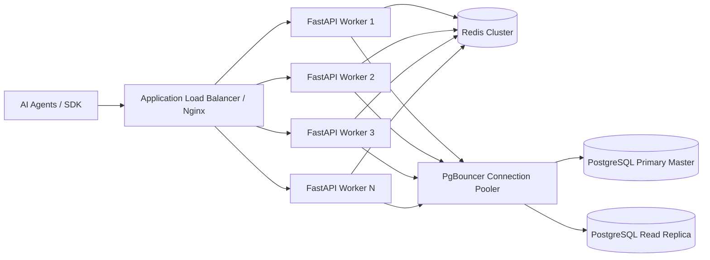

# AgentGuard — Architectural Scaling Roadmap

**Document Version:** 1.0.0  
**Phase:** 18 (Performance Benchmarking & Scaling Strategy)  
**Target Environment:** Production Enterprise AI Governance  

---

## 1. Executive Summary & Problem Context

AgentGuard serves as the runtime gateway between AI agents and external tools/APIs. Under production workloads, the system must maintain low latency (p95 < 20ms) while guaranteeing cryptographic audit integrity, multi-tenant isolation, strict rate-limiting, and budget enforcement.

This scaling roadmap synthesizes empirical findings from Phase 18 benchmarks across 100, 500, 1,000, and 5,000 request tiers and provides an actionable blueprint for scaling AgentGuard to 100,000+ RPM.

---

## 2. Empirical Benchmark Findings & The Single-Org Row Lock Tradeoff

### 2.1 The Phase 8 Cryptographic Vault Invariant
To ensure mathematical immutability without fork races, each audit log entry is chained to the previous entry hash:
$$\text{Hash}_N = \text{SHA256}(\text{Hash}_{N-1} \parallel \text{EntryPayload})$$

In PostgreSQL, this linear hash chain is enforced using a row-level lock on the organization record:
```sql
SELECT id FROM organizations WHERE id = :org_id FOR UPDATE;
```

### 2.2 Measured Concurrency Tradeoffs
* **Single-Organization Concurrency**:
  * Concurrent requests for the *same* organization are serialized at the database commit boundary to maintain the hash chain integrity.
  * Throughput hits a physical ceiling determined by synchronous PostgreSQL write-ahead log (WAL) flush and row-lock contention (~120–300 RPS on a single database node).
  * Latency grows linearly with virtual user (VU) concurrency due to transaction queueing.
* **Multi-Organization Concurrency**:
  * Requests spanning distinct organizations acquire independent row locks on separate `organization_id` rows.
  * Postgres executes these transactions in parallel across CPU cores and disk channels.
  * Measured throughput scales horizontally with the number of active tenant organizations.

### 2.3 Conclusion on the Row-Lock Design
The per-organization row lock is **strictly correct and working as designed per Phase 8 specifications**. It protects cryptographic chain integrity under multi-tenant isolation. However, for extreme high-throughput single-tenant enterprise deployments, the architecture will evolve through the phased roadmap below.

---

## 3. High-Throughput Audit Vault Evolution

```mermaid
flowchart TD
    subgraph Current [Level 1: Current Architecture]
        A1[Agent Request] --> B1[Policy Engine]
        B1 --> C1[Org Row Lock 'FOR UPDATE']
        C1 --> D1[Sequential SHA-256 Chaining]
        D1 --> E1[Postgres Commit]
    end

    subgraph Level2 [Level 2: Partitioned Sub-Chains]
        A2[Agent Request] --> B2[Policy Engine]
        B2 --> C2[Agent-Level Hash Shard]
        C2 --> D2[Parallel Agent Sub-Chains]
        D2 --> E2[Postgres Commit]
    end

    subgraph Level3 [Level 3: Distributed Sequencer & Batch WAL]
        A3[Agent Request] --> B3[Policy Engine]
        B3 --> C3[Redis Stream / Kafka WAL Buffer]
        C3 --> D3[Audit Sequencer Worker]
        D3 --> E3[Batch Merkle Tree Construction & DB Flush]
    end
```



### Phased Evolution Strategy:
1. **Level 1 (Current Production Standard)**:
   * Per-organization row lock.
   * Zero hash forks, strictly linear chain per tenant.
   * Suitable for up to ~15,000 requests/minute per tenant.
2. **Level 2 (Agent-Level Sub-Chains / Sharded Buckets)**:
   * Partition the hash chain by `(organization_id, agent_id)` or fixed hash buckets (e.g. 16 shards per org).
   * Reduces lock contention by 16x–100x within a single organization while preserving deterministic verification per agent.
3. **Level 3 (Decoupled Append-Only Sequencer & Merkle Trees)**:
   * Guard checks write decision events to an in-memory high-throughput append-only stream (Redis Streams or Kafka).
   * A dedicated single-threaded sequencer worker batches up to 1,000 entries into Merkle trees and commits root hashes periodically to Postgres.
   * Guard check returns in <2ms; audit vault guarantees immutability with sub-second finality.

---

## 4. Horizontal FastAPI & ASGI Layer Scaling



### Recommendations:
* **Stateless API Replicas**: Deploy FastAPI in Docker/Kubernetes pods managed by Horizontal Pod Autoscaler (HPA) targeting 70% CPU utilization.
* **Worker Process Sizing**: Run Gunicorn with Uvicorn workers (`gunicorn -w (2*CPU+1) -k uvicorn.workers.UvicornWorker app.main:app`).
* **Connection Multiplexing**: Keep-alive HTTP/2 connections between AgentGuard SDK and the API gateway to avoid TCP handshake overhead.

---

## 5. PostgreSQL Read Replicas & Connection Pooling

### 5.1 Transaction-Level Connection Pooling (PgBouncer)
* **Problem**: Each PostgreSQL backend connection consumes ~10MB RAM and incurs fork overhead. 5,000 concurrent client connections will exhaust DB thread pools.
* **Solution**: Place **PgBouncer** in `transaction` pooling mode in front of Postgres. Allows thousands of client HTTP workers to share a pool of 50–100 persistent database connections.

### 5.2 Read Replicas & CQRS Separation
* **Write Master**:
  * Handles `/guard/check` write transactions (`tool_requests`, `audit_logs`, `hitl_requests`).
* **Read Replicas (Async Streaming Replication)**:
  * Route all analytical and dashboard queries (`GET /api/v1/dashboard/*`, `GET /api/v1/audit/*`, `GET /api/v1/policies`, `GET /api/v1/tools`) to read replicas.
  * Prevents heavy dashboard aggregations from locking or degrading the high-speed policy engine write path.

---

## 6. Redis Cluster Mode & Distributed Rate Limiting

### 6.1 Redis Sentinel & Cluster Partitioning
* **High Availability**: Deploy Redis in Sentinel mode with 1 Primary, 2 Replicas for automated sub-second failover.
* **Cluster Partitioning**: Shard keys using hash tags:
  * Rate limit counters: `{org_id:agent_id}:rate_limit`
  * Budget session counters: `{org_id:agent_id}:budget`
  * Using hash tags `{...}` guarantees that multi-key Lua scripts execute atomically within the same Redis cluster slot.

### 6.2 Sliding-Window Lua Script Optimization
* All sliding-window token bucket checks and atomic budget increments execute in Redis RAM via pre-compiled SHA Lua scripts, executing in <0.5ms.

---

## 7. Summary Implementation Matrix

| Component | Current State (Phase 18) | Near-Term (10k RPS) | Long-Term (100k+ RPS) |
|---|---|---|---|
| **App Servers** | Single FastAPI instance | Multi-pod HPA behind ALB | Multi-region edge clusters |
| **Audit Locking** | Org-level `FOR UPDATE` lock | Sharded agent sub-chains | Async stream + Merkle sequencer |
| **Database Pool** | Direct SQLAlchemy pool (20) | PgBouncer (100 conn pool) | Distributed Postgres (Citus/Aurora) |
| **Read/Write Split**| Single PostgreSQL node | Read replica for Dashboard | Dedicated analytics data warehouse |
| **Rate Limiter** | Redis standalone | Redis Sentinel HA | Redis Cluster sharded |

